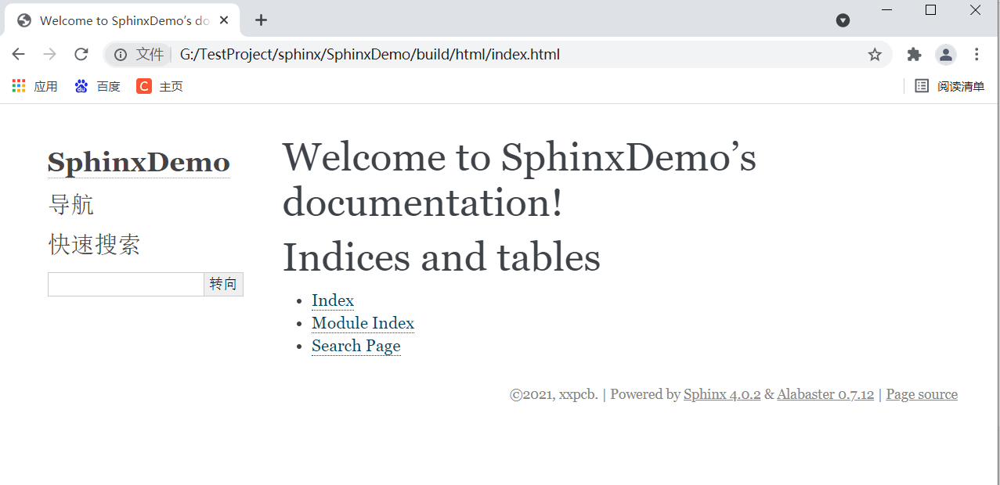
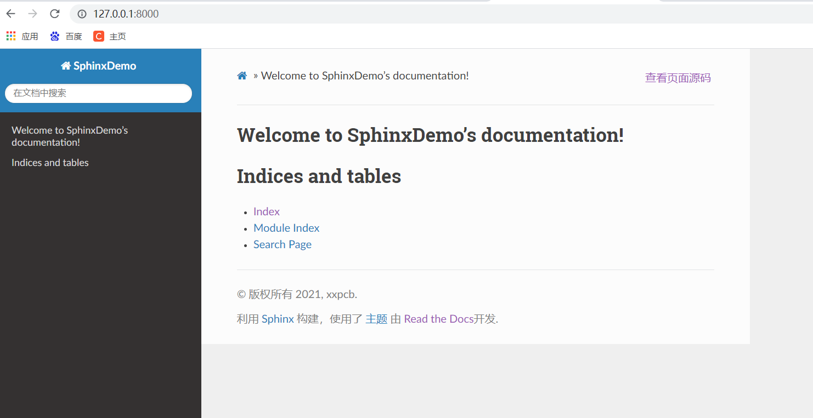
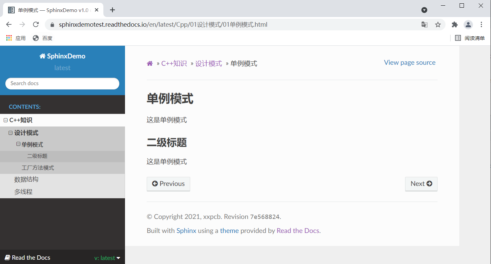

本项目介绍一种在线文档系统的搭建，需要借助Sphinx、gitee和Read the Docs。

- Sphinx是一个功能强大的文档生成器，具有许多用于编写技术文档的强大功能

- Read the Docs是一个在线文档托管服务， 你可以从各种版本控制系统中导入文档

### 安装环境

- Windows系统
- python3环境

### 各个文件作用

- `build`：生成的文件的输出目录
- `source`: 存放文档源文件
  - `_static`：静态文件目录，比如图片等
  - `_templates`：模板目录
  - `conf.py`：进行 Sphinx 的配置，如主题配置等
  - `index.rst`：文档项目起始文件，用于配置文档的显示结构
- `cmd.bat`：这是自己加的脚本文件（里面的内容是‘cmd.exe’）,用于快捷的打开windows的命令行
- `make.bat`：Windows 命令行中编译用的脚本
- `Makefile`：编译脚本，make 命令编译时用

### Sphinx基础测试效果

### 更改样式主题

### 修改文档结构

查看Read the Docs上的效果：<https://sphinxdemotest.readthedocs.io/en/latest/>

### 演示视频

视频链接：<https://www.bilibili.com/video/BV1S5411T7Qg>

### 图文教程

图文教程详细操作：<https://zhuanlan.zhihu.com/p/384863296>

### 推荐学习

- B站：<https://space.bilibili.com/146899653>
- 个人博客：<https://xxpcb.gitee.io>
- 知乎：<https://www.zhihu.com/people/xxpcb>
- CSDN：https://blog.csdn.net/hbsyaaa
- 微信公众文章：

感谢支持~